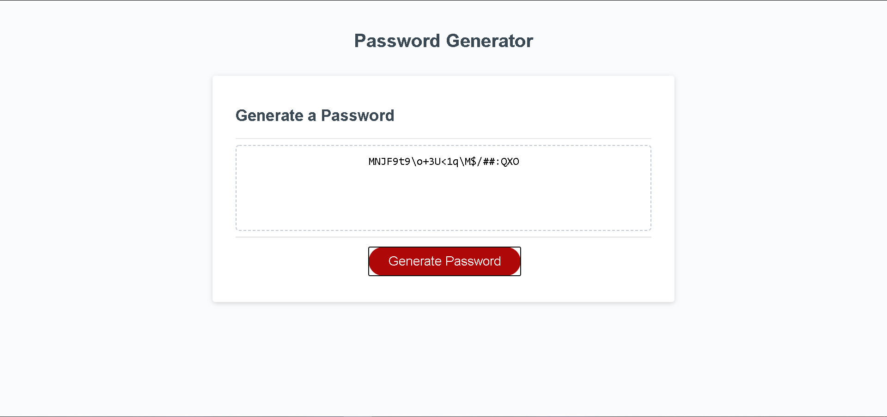

# 03-Password-Generator

## Link to Website
https://john-paul-grace.github.io/03-Password-Generator/

## Description

This website creates a randomly generated password using input from the user. When the user presses the "Generate Password" button, several prompts appear asking the user what criteria they would prefer. First, the user is asked for a length between 8 and 128. If the given length is not within those parameters, the app asks for the length again. Next, the user is asked to confirm whether or not they want each of the different categories of characters. Finally, a password is randomly generated using the selected characters and is displayed on the screen.

## Contributions

The entire HTML and CSS was provided as starter code. A small amount of JavaScript was provided as well. The majority of the JavaScript was written by me.

## Screenshots
- Length: 25
- Lower Case: Yes
- Upper Case: Yes
- Numbers: Yes
- Special Characters: Yes

---
- Length: 50
- Lower Case: Yes
- Upper Case: Yes
- Numbers: No
- Special Characters: No

---
- Length: 128
- Lower Case: No
- Upper Case: No
- Numbers: Yes
- Special Characters: Yes
